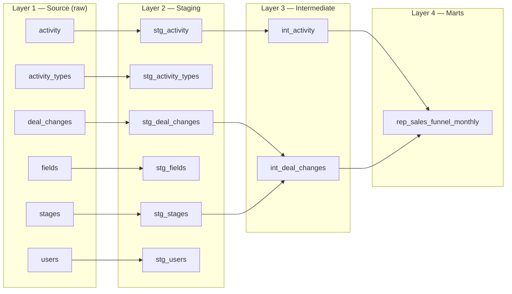

## Setup

1. Download Docker Desktop (if you don’t have installed) using the official website, install and launch.
2. Fork this Github project to you Github account. Clone the forked repo to your device.
3. Open your Command Prompt or Terminal, navigate to that folder, and run the command `docker compose up`.
4. Now you have launched a local Postgres database with the following credentials:
 ```
    Host: localhost
    User: admin
    Password: admin
    Port: 5432 
```
5. Connect to the db via a preferred tool (e.g. DataGrip, Dbeaver etc)
6. Install dbt-core and dbt-postgres using pip (if you don’t have) on your preferred environment.

## Project Tasks

1. Dive deep into the Pipedrive CRM source data to gain a thorough understanding of all its details. (You may also research the Pipedrive CRM tool terms.)
2. Define dbt sources and build the necessary layers, organizing the data flow for optimal relevance and maintainability.
3. Build a reporting model (`rep_sales_funnel_monthly`) with monthly intervals, incorporating these funnel steps (KPIs):
   - Step 1: Lead Generation
   - Step 2: Qualified Lead
   - Step 2.1: Sales Call 1
   - Step 3: Needs Assessment
   - Step 3.1: Sales Call 2
   - Step 4: Proposal/Quote Preparation
   - Step 5: Negotiation
   - Step 6: Closing
   - Step 7: Implementation/Onboarding
   - Step 8: Follow-up/Customer Success
   - Step 9: Renewal/Expansion
4. Column names of the reporting model: `month`, `kpi_name`, `funnel_step`, `deals_count`.

---
## Solution

### 📋 DBT Modelling Overview

This lineage illustrates a data transformation pipeline built with dbt, showing how data moves through the project from raw sources to analytics-ready models.

The pipeline follows a three-layer architecture pattern commonly used in dbt projects:

| Medallion | Project layer | Description | Examples |
|---|---|---|---|
| Bronze | Layer 1 — Source (raw) | immutable raw ingests from Pipedrive | activity, activity_types, deal_changes, fields, stages, users |
| Silver | Layer 2 — Staging (`stg_*`) | standardized, type-cast, timezone-normalized, de-duplicated rows; stable keys, `snake_case`, and PII flags via `meta.contains_pii: true` | stg_activity, stg_activity_types, stg_deal_changes, stg_fields, stg_stages, stg_users |
| Gold | Layer 3 — Intermediate (`int_*`) | business-ready aggregates and KPIs (monthly funnel metrics such as `int_activity`, `int_deal_changes`) | int_activity, int_deal_changes |
| Reports (Platinum) | Layer 4 — Marts (`rep_*`) | analytics-facing outputs with clear grain | rep_sales_funnel_monthly (one row per (`month`, `kpi_name`)) |


This mapping keeps raw cleaning separate from business logic and reporting, improving lineage, testing, governance, and performance.

#### 🗺️ Data Flow Diagram



##### 🥉 Layer 1 — Source Tables

The pipeline begins with raw source tables from Pipedrive CRM:

- **activity** — activity records and metadata.
- **activity_types** — definitions of activity types and their parameters.
- **deal_changes** — change log entries for deals.
- **fields** — CRM configuration for key deal/lead fields.
- **stages** — pipeline stages and ordering.
- **users** — user directory and attributes.

These tables are the raw inputs for all downstream transformations.

---

##### 🥈 Layer 2 — Staging (stg_*)

**Purpose.** Clean, type-safe, row-per-row views of raw sources. Staging models:
- keep the **source grain** (no aggregation),
- **rename** columns to `snake_case`,
- **cast** to correct data types,
- **standardize** timestamps and time zones,
- **expose only fields** needed downstream.

**Materialization.** Defaults to **view** unless overridden in the model config.

All column docs live in **`models/staging/schema.yml`**.

**Documentation metadata.** Include this flag for PII tracking:

    meta:
      contains_pii: true

**PII — definition & handling**

- **What it is:** data that can directly or indirectly identify a natural person.
- **Common examples in Pipedrive:** full name, email address, phone number, postal address, user/account IDs, device/IP info, and **free‑text** fields (e.g., activity notes) that may incidentally contain PII.
- **How we handle it:**
  - Set `meta.contains_pii: true` on models (and on specific columns when supported) that hold PII.
  - Avoid `SELECT *` in staging; select only the columns required downstream.
  - Mask/redact in non‑prod (e.g., hash emails, obfuscate phone/address); use deterministic hashes when joins are needed.
  - Restrict access via roles/column masking/row‑level security where the warehouse supports it.
  - Keep encryption at rest/in transit enabled; audit access to PII tables.
  - Document PII columns in `schema.yml` with clear descriptions and tags (e.g., `tags: [pii, email, phone]`).
  - Add tests to ensure non‑prod never contains raw emails/phones and that downstream models don’t re‑expose dropped PII.
  - Define retention windows and purge jobs for raw/source tables per policy.
- **Rule of thumb:** if a model doesn’t need PII to meet its purpose, **drop or hash it in staging**.

---

##### 🥇 Layer 3 — Intermediate Models

The staging models feed into business logic models with **monthly aggregations**.

**Models**

- **int_activity** — monthly KPI for deals entering Sales Call stages.
  - **Columns:**
    - `month` — first day of the reporting month.
    - `kpi_name` — stage label.
    - `funnel_step` — numeric stage order (e.g., 3.1).
    - `deals_count` — distinct deals entering the stage.

- **int_deal_changes** — monthly KPI for how many distinct deals entered each pipeline stage.
  - **Columns:**
    - `month` — first day of the reporting month.
    - `kpi_name` — stage name.
    - `funnel_step` — integer stage order.
    - `deals_count` — distinct deals entering the stage.

**Implementation details**

- **int_activity**
  - **Config highlights:** monthly tagging; optional indexes on `month` and `funnel_step`; periodic `analyze` to keep planner statistics fresh.
  - **Logic (what & why):**
    - **Bucket to month** from `stg_activity.due_to` to align with reporting grain and reduce cardinality.
    - **Filter to completed sales‑call interactions** (Sales Call 1 and Sales Call 2) to avoid counting scheduled/abandoned tasks.
    - **Count distinct `deal_id`** per `(month, kpi_name)` so multiple activities on the same deal don’t double‑count.
    - **Assign numeric `funnel_step` (2.1, 3.1)** for stable ordering and easy merging with other KPIs.
    - **Select only required columns** to minimize scan and keep the schema aligned with the mart.

- **int_deal_changes**
  - **Config highlights:** monthly tagging; optional indexes on `month`/`funnel_step`; periodic `analyze` for accurate optimizer stats.
  - **Logic (what & why):**
    - **Identify true stage entries** by focusing on records where the changed field denotes a pipeline stage transition; avoids inflating counts from non‑stage edits.
    - **Derive `month` from normalized `change_time`** (timezone handling is already done in staging) to match the reporting grain.
    - **Map stage IDs to labels** via `stg_stages` for readable `kpi_name` and to enforce accepted values.
    - **Count distinct `deal_id`** per `(month, stage)` to prevent multiple transitions within the same month from over‑counting.
    - **Use integer `funnel_step` = stage order** so sorting and downstream joins stay simple and deterministic.

- **Shared optimizations**
  - **Pre‑aggregation in Intermediate** shrinks data scanned by marts and BI tools.
  - **Minimal column selection** and **pushdown filters** improve scan efficiency and cache reuse.
  - **Consistent schema** (`month`, `kpi_name`, `funnel_step`, `deals_count`) across both models makes the mart‑level union cheap and robust.

**Documentation:** **`models/intermediate/schema.yml`**.

---

##### 📊 Layer 4 — Marts Models

All transformations converge into the final analytical model.

**Model**

- **rep\_sales\_funnel\_monthly** — provides a table of **distinct deals** that achieved each funnel step in a given month.
  - **Grain:** one row per (`month`, `kpi_name`).
  - **Columns:**
    - `month` — first day of the reporting month.
    - `kpi_name` — stage label.
    - `funnel_step` — numeric stage order.
    - `deals_count` — distinct count of deals entering the stage.

**Implementation details**

- **Config:** indexes on `month` and `funnel_step` **to speed common filters (month slicing) and joins on `funnel_step`**; `post_hook: analyze {{ this }}` **to refresh planner statistics** for better query execution plans.
- **Build logic:** uses `dbt_utils.union_relations(relations=[ref('int_activity'), ref('int_deal_changes')], source_column_name=None)` **to safely stack monthly KPI rows** (aligns columns by name, avoids brittle manual `UNION ALL`), and with `source_column_name=None` **does not add an origin column**.

**Documentation:** **`models/intermediate/schema.yml`**.

---

##### 🛡️ Quality Guarantees & Conventions

- **Layered, deterministic transformations:** Sources → Staging (type casts and time‑zone standardization — e.g., `stg_activity.due_to` adjusted; `stg_deal_changes.change_time` made timezone‑naive) → Intermediate (monthly KPIs per stage) → Marts (`rep_sales_funnel_monthly`, one row per (`month`, `kpi_name`)).
- **Clear semantics & grain:** `month` is the first day of the reporting month; `deals_count` is the distinct count of deals entering a stage within that month; `funnel_step` encodes stage order (integers and sub‑steps such as `2.1`, `3.1`).

- **PII & naming conventions:** set `meta.contains_pii: true` where applicable; avoid `SELECT *`; mask PII in non‑prod. Use `snake_case`, `_id` for keys, `*_at` for timestamps, and `is_*` booleans.

This architecture follows **dbt best practices** for maintainable, auditable analytics.

---

##### 🧹 YAML Lint Rules (.yamllint)

- **Scope:** applies to `*.yaml`, `*.yml`, and the `.yamllint` file itself.
- **Enforced (errors):** `braces`, `brackets`, `colons`, `commas`, `hyphens`, `indentation`, `key-duplicates`, `new-line-at-end-of-file`, `new-lines`, `trailing-spaces`.
- **Disabled:** `document-start`, `document-end`, `key-ordering`, `octal-values`, `quoted-strings`.
- **Warnings (non-blocking):** `comments`, `comments-indentation`, `truthy`, `line-length` (max **120** chars).

> Rationale: strict structure/whitespace checks prevent subtle YAML parse errors; ordering is flexible; long lines and truthy values surface as warnings rather than hard failures.

---

##### ⚙️ Execution Settings (profiles.yml)

- **threads: 4** — increased parallelism for faster `dbt build/test` on multi-core machines.
- **Why:** speeds up compilation and model execution when models are independent.
- **Notes:** ensure warehouse concurrency limits and memory are sufficient; adjust per environment if contention occurs.

---

### 🧪 DBT Tests Overview

**Scope & location.** All data tests are defined in `models/**/schema.yml`. Staging tests live in `models/staging/schema.yml`; intermediate and marts tests live in `models/intermediate/schema.yml`.

**Staging (`stg_*`)**
- `unique` + `not_null` on chosen primary keys.
- `accepted_values` on constrained enums/statuses.
- `relationships` where FK-like references exist (e.g., `user_id`, `activity_type_id`).

**Intermediate**
- `int_activity`
  - `month`: not_null
  - `kpi_name`: accepted_values — "Sales Call 1", "Sales Call 2"; not_null
  - `funnel_step`: accepted_values — 2.1, 3.1; not_null
  - `deals_count`: not_null
- `int_deal_changes`
  - `month`: not_null
  - `kpi_name`: accepted_values — "Lead Generation", "Qualified lead", "Needs Assessment", "Proposal/Quote Preparation", "Negotiation", "Closing", "Implementation/Onboarding", "Follow-up/Customer Success", "Renewal/Expansion"; not_null
  - `funnel_step`: accepted_values — 1, 2, 3, 4, 5, 6, 7, 8, 9; not_null
  - `deals_count`: not_null

**Marts**
- `rep_sales_funnel_monthly`
  - Uniqueness: one row per (`month`, `kpi_name`) — enforce `unique` on (`month`, `kpi_name`).
  - Not null: `month`, `kpi_name`, `funnel_step`, `deals_count`.
  - Accepted values:
    - `kpi_name`: "Lead Generation", "Qualified lead", "Sales Call 1", "Needs Assessment", "Sales Call 2", "Proposal/Quote Preparation", "Negotiation", "Closing", "Implementation/Onboarding", "Follow-up/Customer Success", "Renewal/Expansion".
    - `funnel_step`: 1, 2, 2.1, 3, 3.1, 4, 5, 6, 7, 8, 9.

**Unit tests — staging models (`tests/unit/models/staging`)**

- **`test_stg_activity.yml` → `stg_activity`**
  - **Purpose:** localize `due_to` to **Europe/Berlin** with correct DST offsets and include timezone info.
  - **Given:** `source('postgres_public', 'activity')` (3 rows) with **naive** `due_to` timestamps like `2024-07-24 06:47:10.000` and `2024-01-28 21:36:04.000`.
  - **Expect:** 3 rows with columns `[activity_id, type, assigned_to_user, deal_id, done, due_to]`; `due_to` becomes `2024-07-24 08:47:10.000 +0200` and `2024-01-28 22:36:04.000 +0100` (DST-aware).

- **`test_stg_deal_changes.yml` → `stg_deal_changes`**
  - **Purpose:** standardize `change_time` to **timezone‑naive** format.
  - **Given:** `source('postgres_public', 'deal_changes')` (3 rows) with `+0200` offsets.
  - **Expect:** 3 rows with columns `[deal_id, change_time, changed_field_key, new_value]`; `change_time` like `2024-04-09 21:32:09.000` (no timezone suffix).

- **`test_stg_users.yml` → `stg_users`**
  - **Purpose:** ensure `modified` timestamps are **UTC‑explicit**.
  - **Given:** `source('postgres_public', 'users')` (3 rows) with **naive** `modified` values.
  - **Expect:** 3 rows with columns `[id, name, email, modified]`; `modified` rendered with `+00:00` (e.g., `2024-04-27 04:51:50.980000+00:00`).
 
 **How to use unit tests**

- **Run unit tests for one staging model:**

```bash
# example: only unit tests targeting stg_activity
dbt test --select "stg_activity,test_type:unit"
```

- **Run all unit tests:**

```bash
dbt test --select "test_type:unit"
```

- **When to run:**
  - **Development:** use unit tests for a test‑driven workflow while editing SQL.
  - **CI:** run unit tests on every PR to catch regressions early.
  - **Production:** **do not** run unit tests — inputs are static fixtures, so there’s no benefit to spending compute cycles in prod.

> Notes: These are **native dbt unit tests** expressed in YAML (`unit_tests:`), separate from data tests in `schema.yml`. They verify row‑level transformations and timezone semantics before aggregation layers.

---

### 💡 Key Insights: Funnel Findings & Improvements

**Funnel performance**
- **Sales calls correlate with higher conversion:** stages gated by sales‑call activities show **77–85% completion** between adjacent steps.
- **Seasonality:** lead volume peaks **Apr–Aug 2024**.
- **2,000 leads → 324 at Renewal/Expansion** (≈**84% drop‑off**, ~**16% conversion** end‑to‑end).
- **Cycle time:** ≈**108 days** from **CRM user creation → outcome**; ≈**58 days** from **Step 1 → final stage** — opportunities to streamline handoffs and SLAs.
- **Largest loss between Stage 1 and Stage 2** (qualification). Recommend tightening **lead qualification** and improving **lead‑source quality**.

**Potential improvements**
- **`activity_types` coverage:** several fields unused — some **inactive**, others **not mapped** to funnel steps; document but exclude from marts.
- **Owner reassignment:** ~**25%** of deals have **>2 owner assignments** — validate with latest data; **remove if not supported**.
- **`deal_changes.lost_reason`** appears populated for **all** deals, including fully closed; review business semantics and expected lifecycle.
- **`activity` duplicates:** duplicate **`activity_id`** values observed; does **not** impact the final report but warrants CRM data‑entry checks and/or staging‑level deduping.
- **Unused sources:** some **source tables** are not referenced in the final mart. Optional enhancements:
  - Link **users ↔ deals** to attribute performance to owners/teams.
  - Surface **`lost_reason`** in funnel outputs (from `stages`/`deal_changes`) for loss analysis.
- **Cohorted dates:** introduce cohort anchors (e.g., `deal_created_month`, `first_activity_month`, or acquisition month) to compare like‑with‑like across time; can potentially improve seasonality analysis, reveal lag effects, and stabilize conversion rates across cohorts; additionally enable **lifetime value (LTV)** and **churn/retention** analysis by cohort (e.g., cohort survival tables, time‑to‑churn curves, rolling LTV).

